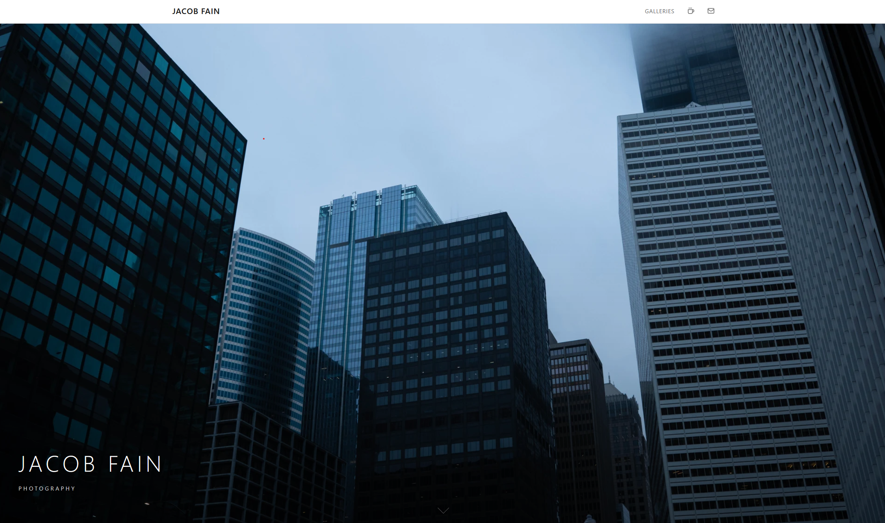
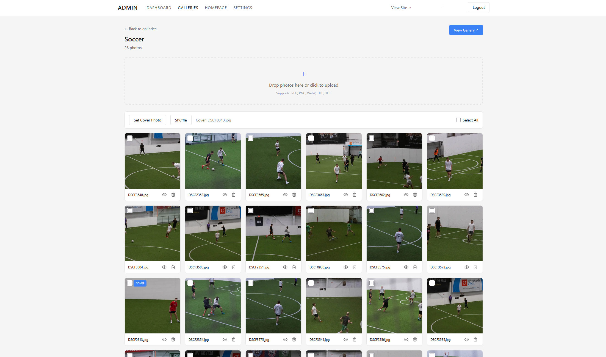

### [View Site ( jacobfain.gallery )](https://jacobfain.gallery)


A self-hosted photography portfolio with private gallery sharing, image optimization, and analytics.





## Overview

Gallery is a full-stack photography portfolio platform designed for photographers who want complete control over their work. It combines a public-facing portfolio with password-protected client galleries, all backed by a comprehensive admin dashboard.

The system runs on self-hosted infrastructure with cloud storage, striking a balance between cost efficiency and performance. Photos are stored on AWS S3 with automatic optimization, while compute runs on a home server exposed securely through Cloudflare Tunnel.


## Technology Stack

| Layer | Technologies |
|-------|--------------|
| Frontend | React 19, TypeScript, Vite, React Router 6 |
| Backend | Node.js 20, Express 5, TypeScript |
| Database | PostgreSQL 15 |
| Storage | AWS S3 (signed URLs, three-tier image storage) |
| Auth | JWT, bcrypt |
| Infrastructure | Docker, Nginx, Cloudflare Tunnel |

## Features

### Public Site

- Full-viewport hero section with featured photo
- Responsive masonry photo grid with lazy loading
- Lightbox with pinch-to-zoom, swipe navigation, and swipe-to-dismiss
- EXIF metadata overlay (camera, lens, settings)
- Full-resolution download and gallery ZIP export
- Password-protected private galleries with session tokens

### Image Pipeline

- Three-tier storage: original (preserved), web (1920px WebP), thumbnail (600px WebP)
- Automatic WebP conversion (30% smaller than JPEG)
- EXIF extraction stored as JSONB
- Signed S3 URLs with 1-hour expiration and in-memory caching

### Admin Dashboard

- Drag-and-drop batch photo upload with per-file progress
- Photo and gallery reordering via drag-and-drop
- Featured photo management (hero + grid selection)
- Hide individual photos from public view
- Analytics dashboard with view/download charts
- Site settings configuration

| | |
|---|---|
|  |  |

## Architecture

```
                                            Internet
                                                |
                    
                        
                                        Cloudflare Tunnel
                                                |
                                                v
                        +----------------------------------------------+
                        |             Home Server (Docker)             |
                        |                                              |
                        |           Nginx -> Express -> Postgres       |
                        |                       |                      |
                        +-----------------------+----------------------+
                                                |
                                                v
                                            AWS S3
```

### Design Decisions

| Decision | Rationale |
|----------|-----------|
| Self-hosted compute | Full control, zero hosting cost, Docker experience |
| AWS S3 for images | Scalable storage, fast delivery, industry standard |
| Cloudflare Tunnel | Secure exposure without port forwarding, hides home IP |
| Three-tier images | Fast page loads without sacrificing download quality |
| Subdomain routing | Clean separation of public site and admin interface |

## Deployment

The production environment runs via Docker Compose with:
- Multi-stage frontend build (Vite build, served by Nginx)
- Node.js backend with health checks
- PostgreSQL with volume persistence
- Automated database migrations

## Security

- Passwords hashed with bcrypt (10 rounds)
- JWT tokens with 7-day expiration
- Private gallery access tokens (24-hour expiration)
- S3 signed URLs (1-hour expiration)
- Rate limiting on tracking endpoints
- Non-root Docker containers
- Cloudflare Tunnel (no exposed ports)

## License

MIT
